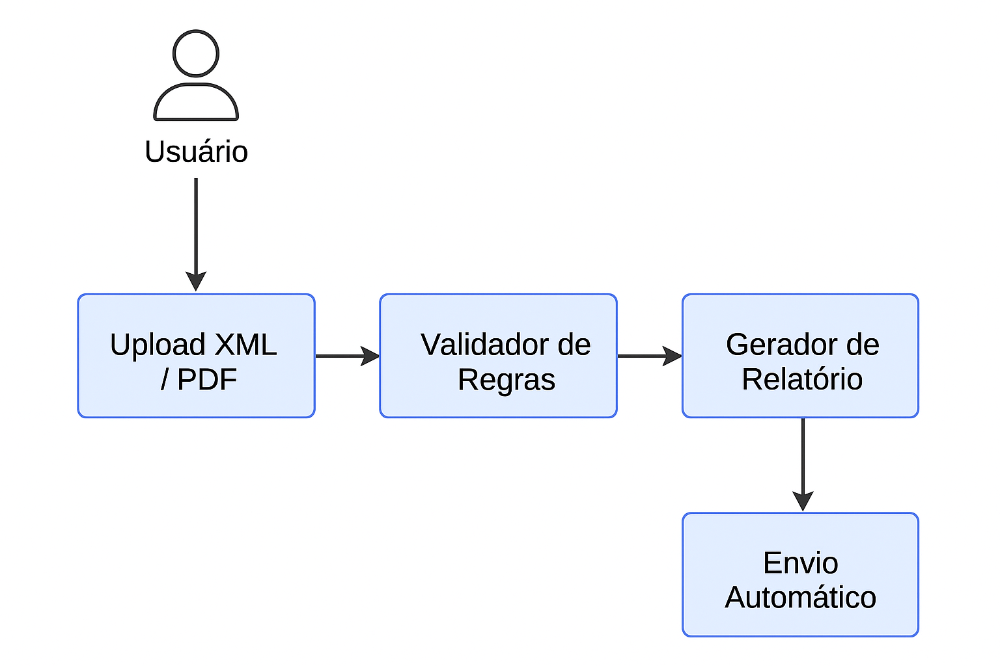
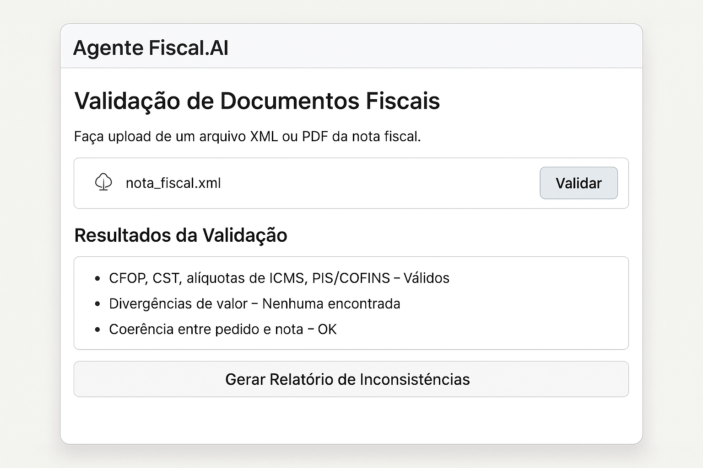

# 🧾 Proposta de Projeto – Agente Fiscal.AI

## 👥 Nome do Grupo
**Guardião Fiscal**

## 👨‍💻 Integrantes do Grupo
| Nome Completo          | Telefone          | E-mail                         | Contribuiu com a Atividade? |
| ---------------------- | ----------------- | ------------------------------ | --------------------------- |
| Carlos Magno Marcelino | +55 11 98949-8106 | cmmarcelinus@gmail.com         | ✅ Sim                      |
| Ewerton                | +55 22 98870-9994 | bomsensoink@gmail.com          | ⬜ Não                      |
| Vivian                 | +55 11 98488-2650 | vivian.ruiz74@gmail.com        | ⬜ Não                      |
| Martins Adriano        | +244 932 964 743  | martinsmussinda@gmail.com      | ⬜ Não                      |

---

## 🎯 Tema Escolhido

**Desenvolvimento de um Agente Autônomo de Validação e Auditoria de Documentos Fiscais Eletrônicos (NFe / NFC-e / CT-e / MDF-e).**

---

## 👤 Público-Alvo

- Escritórios de contabilidade  
- Analistas fiscais  
- Empresas com alto volume de notas fiscais

---

## ❗ Justificativa

A escrituração fiscal manual, além de morosa, é suscetível a falhas humanas e inconsistências tributárias. Com o aumento do volume de documentos e a complexidade das legislações estaduais e federais, torna-se essencial contar com soluções automatizadas que:

- Reduzem riscos tributários  
- Aumentam a produtividade dos departamentos fiscais  
- Garantem a conformidade legal com normas da Receita Federal e SEFAZ

---

## 💡 Proposta Preliminar

Desenvolver um **Agente Inteligente de Auditoria** que execute:

### 🔹 Entrada:
- Upload de **XML** ou **PDF** de Notas Fiscais Eletrônicas

### 🔹 Processamento:
- **Extração de dados:** OCR + NLP para PDFs escaneados
- **Validação de campos críticos:**
  - CFOP (Código Fiscal de Operações e Prestações)
  - CST (Código de Situação Tributária)
  - Alíquotas de ICMS, PIS e COFINS
  - Valores e totalizações
  - Coerência entre pedido, nota e entrega

### 🔹 Saída:
- Geração de **Relatório Detalhado de Inconsistências**
- **Envio automatizado** do relatório ao setor responsável (via e-mail, drive ou sistema)

---

## 🛠️ Tecnologias Previstas

| Categoria       | Ferramentas Sugeridas                                   |
|----------------|----------------------------------------------------------|
| OCR / NLP      | Tesseract, EasyOCR, Azure OCR                            |
| Lógica Fiscal  | Python + Pandas + Regras Tributárias Customizadas        |
| Agentes IA     | LangChain ou CrewAI                                      |
| Relatórios     | PDFKit, Pandas Styler                                    |
| Interface      | Streamlit (web app leve e interativo)                    |

---

## 🧩 Elementos Visuais

### 📌 Diagrama da Arquitetura do Agente

---

### 📊 Fluxo de Trabalho: Manual vs Automatizado

| Etapa                  | Processo Manual                              | Processo Automatizado com Agente Fiscal.AI        |
|------------------------|----------------------------------------------|----------------------------------------------------|
| Recebimento de NF-e    | Download e leitura individual                | Upload em lote pelo sistema                        |
| Validação Tributária   | Conferência manual de CFOP, CST, etc.       | Análise automática com regras fiscais embutidas    |
| Verificação de valores | Planilhas auxiliares                         | Algoritmos de consistência integrados              |
| Geração de relatórios  | Redigido por analistas                       | Gerado automaticamente em PDF                      |
| Encaminhamento         | Manual por e-mail ou sistemas internos       | Envio automático ao setor responsável              |

---

### 🖼️ Interface Inicial (Mockup)

---

## 📍 Próximos Passos

1. Definição do MVP (Produto Mínimo Viável)
2. Distribuição de tarefas entre os membros
3. Escolha da base de dados de notas fiscais para teste
4. Desenvolvimento dos primeiros módulos: OCR + Validação
5. Geração dos primeiros relatórios de inconsistência
6. Criação da interface inicial com Streamlit

---

## 📢 Considerações Finais

O projeto **Agente Fiscal.AI** se propõe a ser uma **solução real, eficiente e escalável** para auditoria fiscal em um cenário de transformação digital. Combinando tecnologias de IA, RPA e análise tributária, ele busca empoderar contadores e empresas com automação inteligente, conformidade e ganho de tempo.

---

