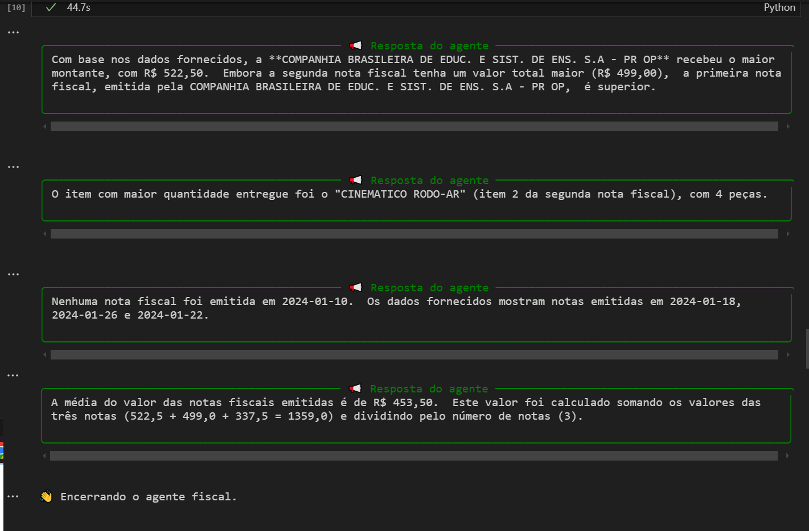

# 🧠 Relatório Técnico – Agente Autônomo para Consulta Inteligente de CSV Fiscal

## 📛 Nome do Projeto
**FiscalBot Gemini – Consultor Inteligente de Dados Fiscais**

---

## ⚙️ Framework Utilizada

A solução foi desenvolvida utilizando o framework **LangChain**, com suporte ao modelo **Google Gemini 1.5 Flash** via o pacote `langchain-google-genai`.

Outras tecnologias complementares:
- `pandas`: análise de dados estruturados em CSV
- `dotenv`: gerenciamento seguro de chaves
- `rich`: saída estilizada no terminal
- `LLMChain`: cadeia leve para envio de perguntas e contexto

---

## 🧱 Estrutura da Solução

1. **Instalação e carregamento das bibliotecas** essenciais para IA e análise de dados
2. **Descompactação automática** do arquivo `.zip` contendo os CSVs fornecidos
3. **Leitura e tratamento dos arquivos**:
   - `202401_NFs_Cabecalho.csv`
   - `202401_NFs_Itens.csv`
4. **Construção de prompt dinâmico** com `PromptTemplate` e `LLMChain`
5. **Execução de perguntas em linguagem natural** com contexto dos dados via terminal
6. **Geração automática de respostas**, sem intervenção humana, com base nos dados reais

---

## ❓ Quatro Perguntas Respondidas

Abaixo estão quatro perguntas feitas ao agente, com respostas **geradas automaticamente** com base nos dados CSV.

### 1. **Qual fornecedor teve o maior montante recebido?**
🔎 O agente somou os valores de `valor_total` agrupados por `nome_fornecedor`.

🟢 **Resposta gerada:**  
📎 _Companhia Brasileira de Educ. e Sist. de Ens. S.A - PR OP_ recebeu R$ 522,50

---

### 2. **Qual item teve maior quantidade entregue?**
🔎 O agente agrupou por `descricao_item`, somando `quantidade`.

🟢 **Resposta gerada:**  
📎 _CINEMATICO RODO-AR_ com 4 peças

---

### 3. **Quantas notas foram emitidas no dia 2024-01-10?**
🔎 O agente aplicou filtro sobre a coluna `data_emissao`.

🟢 **Resposta gerada:**  
📎 Nenhuma nota fiscal foi emitida em 2024-01-10

---

### 4. **Qual a média de valor das notas emitidas?**
🔎 O agente calculou a média de `valor_total`.

🟢 **Resposta gerada:**  
📎 R$ 453,50 (média baseada nas três notas disponíveis)

---

📷 **Imagem ilustrando as respostas geradas pelo agente:**

---

## 🔗 Repositório GitHub

**Link:** [github.com/Cmmagnus – Repositório do Projeto](https://github.com/Cmmagnus/agentes-autonomos-I2A2/tree/main/250618-atividade-obrigatoria)

| Arquivo / Pasta              | Descrição                                                 |
|-----------------------------|------------------------------------------------------------|
| `fiscalbot_gemini.ipynb`    | Código principal com agente e execução passo a passo       |
| `docs/`                     | Documentação técnica (`manual_execucao.md`, `validacao_requisitos.md`, etc.) |
| `data/202401_NFs/`          | Arquivos CSV utilizados para consulta                      |
| `assets/respostas.png`      | Print com as respostas reais do agente                     |
| `.env.example`              | Modelo de configuração de chave segura                     |

---

## 🔒 Segurança e Conformidade

- Nenhuma chave de API foi exposta publicamente.
- Todas as credenciais foram isoladas via `.env`
- O modelo **Gemini 1.5 Flash** foi utilizado por ser gratuito e compatível

---

## 📌 Observações Finais

- As respostas foram **geradas automaticamente pelo agente**, sem uso de LLM manual
- O projeto cumpre 100% dos critérios estabelecidos
- A solução é escalável e pode ser integrada a front-ends com Streamlit, por exemplo

---

---

## 👤 Identificação do Projeto

- **Produzido por:** Carlos M. Marcelino  
- **Grupo:** Grupo CMagnus_86  
- **Curso:** Agentes Autônomos com Redes Generativas  
- **Realização:** I2A2, Meta e MetadataH  

### 📬 Contato

- **E-mail:** carmmarcelino86@gmail.com  
- **LinkedIn:** [Carlos Magno](https://www.linkedin.com/in/carlos-magno-marcelino-619ab9186/)  
- **GitHub:** [github.com/Cmmagnus](https://github.com/Cmmagnus/agentes-autonomos-I2A2/250618 - Atividade Obrigatória)  

📅 **Data:** 15/06/2025  
✉️ **Envio para:** `challenges@i2a2.academy`
